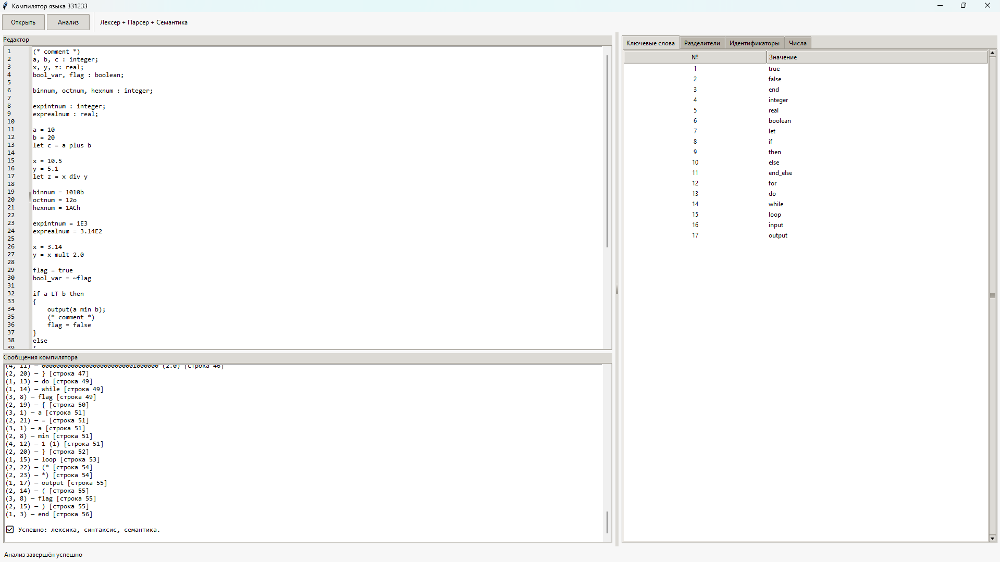

# Компилятор для модельного языка на python
Учебный компилятор для курсовой работы по дисциплине "Теория автоматов и формальных языков."

Проект реализует базовые этапы компиляции:
- Лексический анализ;
- Синтаксический анализ;
- Семантический анализ.

---
## 📌 Возможности
- Разбор исходного кода модельного языка;
- Проверка лексических, синтаксических и семантических ошибок;
- Вывод считанных токенов и дерева разбора;
- GUI для удобства;

---
## 🛠️ Стек технологий
- Python 3.13.0;
- Tkinter;
- Собственная реализация Lexer и Parser;

---
## 🚀 Установка и запуск
```bash
git clone https://github.com/zZencorZz/ATFL-compiler.git
cd ATFL-compiler

python main.py
```

---
## 📂 Структура проекта
```text
app/
├── model_lang/
│   ├── diagrams.drawio     # Диаграммы вирты и блок схемы
│   └── BNF.txt             # Формы Бэкуса-Наура
├── examples/
│   ├── reference.txt       # Эталонный пример программы
│   └── errors.txt          # Примеры ошибок
└── src/
    ├── lexer.py                # Лексический анализатор
    ├── parser.py               # Синтаксический + Семантический анализатор
    ├── tokens.py               # Список допустимых токенов языка
    ├── errors.py               # Классы обработчиков языка
    └── main.py                 # Главный класс с GUI
```

1. lexer.py — посимвольно разбирает исходный код программы на модельном языке на отдельные токены, классифицирует их, логирует этапы разбора и сохраняет в массив. 
2. parser.py — получает список токенов и сверяет их последовательность с эталоном модельного языка. Синтаксический анализ выполняется с помощью метода рекурсивного спуска.
3. tokens.py — хранит массивы ```KEYWORDS``` (служебные слова) и ```SEPARATORS``` (разделители). Помимо этого, хранит 2 подмассива разделителей ```LETTER_SEPARATORS``` и ```SYMBOL_SEPARATORS``` для работы лексера, а так же список видов токенов и класс токена.
4. errors.py — класс основной ошибки, и дочерние классы ошибок лексики, синтаксиса и семантики.
5. main.py — главный класс программы, GUI на `tkinter` и пример исходного кода на модельном языке.

```model_lang``` — хранит диаграммы (в формате ```.drawio```) и формы для описания модельного языка (.```txt```).
```examples``` — хранит эталонный пример языка и примеры ошибок (```.txt```)

---
## 🖼️ Интерфейс


1. Редактор — окно ввода исходного кода ИЛИ загрузки из файла.
2. Открыть — открывает проводник и позволяет выбрать файл с исходным кодом.
3. Анализ — запускает анализ исходного кода: лексика → синтаксис → семантика.
4. Сообщение компилятора — вод результата анализа: логи считанных токенов ИЛИ ошибка.
5. Вкладки справа выводят списки служебных слов, разделителей, переменных и чисел программы (в двоичном и оригинальном виде).

---
## 🛣️ Roadmap
- [x] Lexer
- [x] Parser
- [x] Semantic analysis
- [ ] Code generation

---
## 🚧 Статус проекта
Проект завершён в рамках курсовой работы. Возможен реворк, оптимизация и добавление генерации кода.